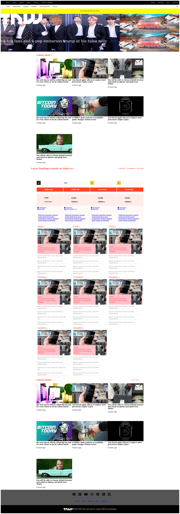

# Project 5 - The_Next_Web_clone

​
This is an assigned project where we were supposed to replicate/clone theNextweb page as seen in the link:
<a href="https://thenextweb.com/">click here</a>
​

​

## Built With

- HTML5
- CSS3
- Google icons (https://www.w3schools.com/icons/icons_reference.asp)
- Fontawesome icons (https://fontawesome.com/)
  ​

## Live Demo of our project

​<a href="https://raw.githack.com/jamestucker1988/tnw/feature/index.html">click here</a>

## Authors

​
👤 **Anand Kumar**
​

- Github: [jamestucker1988](https://github.com/jamestucker1988)
- Twitter: [anandku74070598](https://twitter.com/anandku74070598)
- Linkedin: [Anand Kumar](https://linkedin.com/in/anand-kumar-9128)

## �� Contributing

​
Contributions, issues and feature requests are welcome!
​
Feel free to check the [issues page](https://github.com/jamestucker1988/tnw/issues).
​

## Show your support

​
Give a ⭐️ if you like this project!
​

## �� License

​
This project is [MIT](lic.url) licensed.
